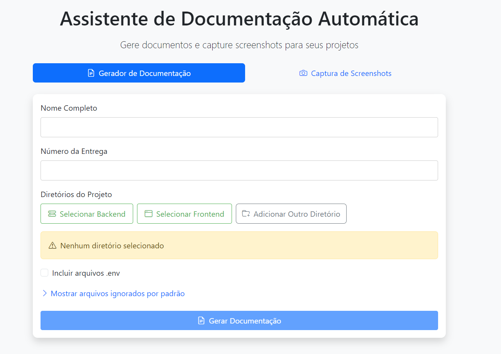
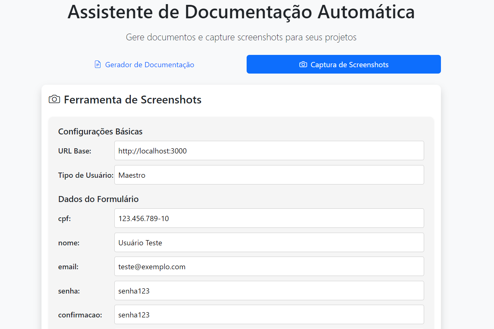
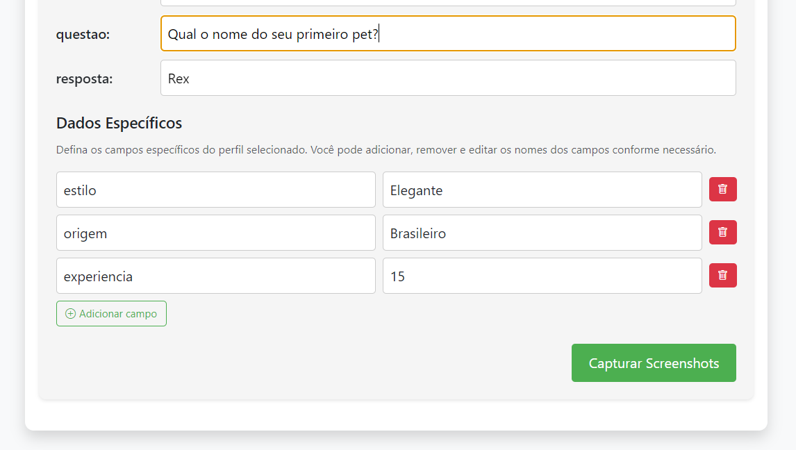

# Assistente de Documentação Automática

Esta aplicação desktop oferece ferramentas para facilitar a documentação de projetos de software, incluindo geração automática de documentação a partir dos códigos-fonte e captura automática de screenshots.





## Funcionalidades

### Gerador de Documentação

- Gera documentos `.docx` e `.pdf` automaticamente a partir do código-fonte.
- Organiza arquivos por diretório com suporte a backend, frontend e outros diretórios.
- Formata corretamente os títulos e o conteúdo dos arquivos.
- Ignora automaticamente diretórios e arquivos de configuração comuns.
- Inclui cabeçalho centralizado e rodapé com local, data e assinatura.

### Ferramenta de Screenshots

- Captura automaticamente screenshots de aplicações web.
- Permite configurar URL base, tipo de usuário e dados de formulários.
- Documenta fluxos completos de interface (login, formulários, confirmações).
- Salva imagens em alta qualidade para inclusão em documentação.

## Tecnologias Utilizadas

### Frontend

- Electron (aplicação desktop)
- React
- Bootstrap para interface de usuário

### Backend

- Node.js para o runtime Electron
- Python para geração de documentação
- Puppeteer para automação de capturas de tela

### Bibliotecas

- `python-docx` (para gerar documentos Word)
- `docx2pdf` (para converter Word para PDF)
- `puppeteer` (para automação de navegadores)

## Instalação

1. Clone o repositório:

```sh
git clone https://github.com/GuilhermeSsampaio/gerador-desktop
cd gerador-desktop
```

2. Instale as dependências do node com npm

```sh
npm install
```

2. Crie o venv

```sh
python -m venv venv
```

3. Para ativar o venv, e instalar dependências do python (somente no windows) basta iniciar a aplicação:

```sh
npm start
```

## Como Usar

### Gerador de Documentação

1. Selecione os diretórios do projeto (backend, frontend, outros)
2. Preencha seu nome e o número da entrega
3. Escolha se deseja incluir arquivos .env
4. Clique em "Gerar Documentação"
5. Os arquivos serão gerados na pasta `arquivos-entrega`
6. Você pode escolher onde salvar

### Ferramenta de Screenshots

1. Selecione a aba "Captura de Screenshots"
2. Configure a URL base da aplicação (ex: http://localhost:3000)
3. Configure o tipo de usuário e os dados para preenchimento
4. Clique em "Capturar Screenshots"
5. As capturas serão salvas na pasta `screenshots`
6. Você pode escolher onde salvar

## Estrutura dos Arquivos Gerados

- Documentos DOCX/PDF com título e nome da entrega
- Cada arquivo de código-fonte é listado com formato `diretório.arquivo : caminho/do/arquivo`
- Screenshots salvos com nomes descritivos (ex: `formulario_preenchido.png`)
- Local, data e espaço para assinatura ao final dos documentos

## Requisitos do Sistema

- Node.js 14+
- Python 3.8+
- Windows, macOS ou Linux

## Licença

Este projeto está sob a licença MIT. Veja o arquivo LICENSE para mais detalhes.
